Hello! I am [Bérénice](http://bebatut.fr/), the author of following slides.

<small>
This slide does not exist in original deck. It is useful if you are not familiar with [Reveal.JS](https://github.com/hakimel/reveal.js), used here.
</small>

The easiest way to navigate this slide deck is by hitting `[space]`on your keyboard.

---

### Analyses of *Prochlorococcus* genomes in a phylogenetic framework

Determine the causes and characteristics of genome reduction

Bérénice Batut

<small>
University of Freiburg  Hess lab meeting  February 2017
</small>

---

### Evolution

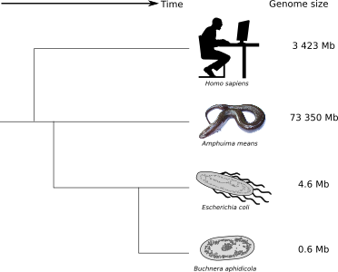

- Same evolution time for all organisms
- No correlation between complexity and genome size
- Reductive genome evolution

How to explain the actual differences in genome size?

---

## Reductive genome evolution in endosymbionts
### Example of *Buchnera aphidicola*

----

### Genome degeneration syndrom

<small>Adapted from [Batut et al, 2014](http://www.nature.com/nrmicro/journal/v12/n12/abs/nrmicro3331.html)</small>

----

### Muller's ratchet

<small>Adapted from [Mira & Moran, 2002](http://link.springer.com/article/10.1007/s00248-002-0012-9)</small>

- Small population size with frequent bottlenecks
- No recombination

----

### Smallest genomes in the smallest populations?

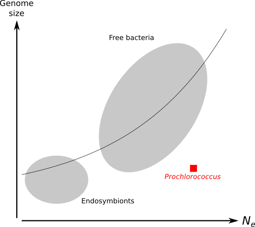

<small>Relation between effective population size and genome size Figure inspired from [Kuo et al, 2009](http://genome.cshlp.org/content/19/8/1450.short)</small>

---

## Reductive genome evolution in *Prochlorococcus*
### An counter-intuitive case 

----

### *Prochlorococcus*

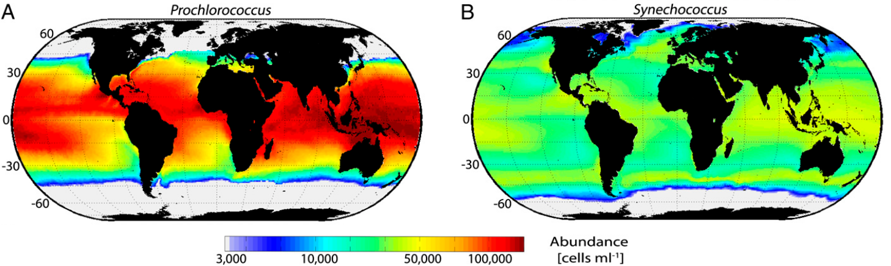

<small>Figure adapted from [Flombaum et al, 2013](http://www.pnas.org/content/110/24/9824.short)</small>

----

### *Prochlorococcus*

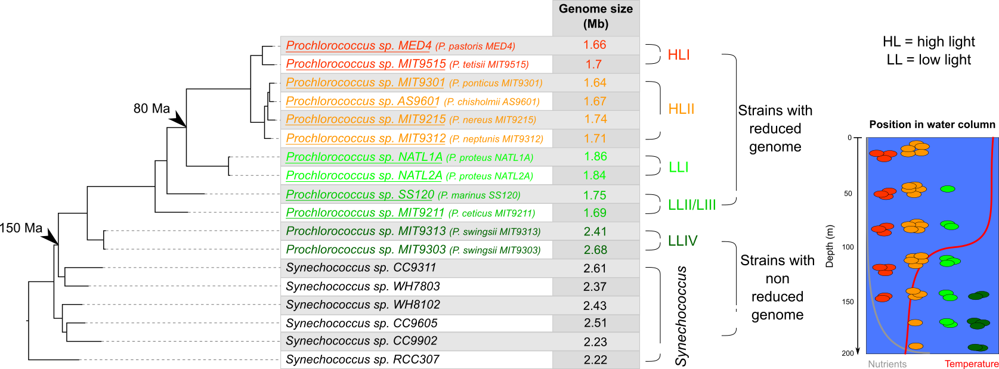

<small>Table adapted from [Batut et al, 2014](http://www.nature.com/nrmicro/journal/v12/n12/abs/nrmicro3331.html)</small>

----

### Changes during *Prochlorococcus* evolution

<small>Table adapted from [Batut et al, 2014](http://www.nature.com/nrmicro/journal/v12/n12/abs/nrmicro3331.html)</small>

----

### Hypotheses for reductive genome evolution

<small> Figures adapted from [Flombaum et al, 2013](http://www.pnas.org/content/110/24/9824.short)</small>

----

### Hypotheses for reductive genome evolution

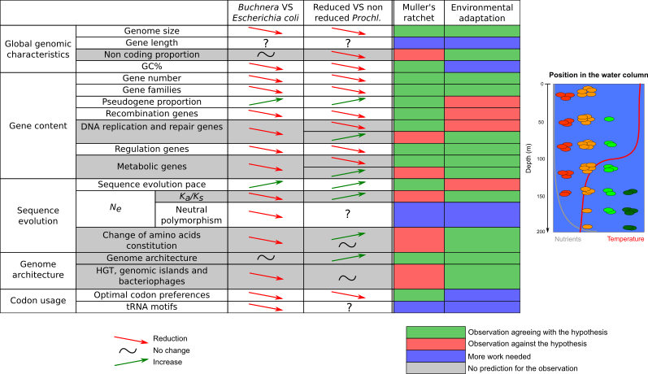

<small>Hypothesis from [Rocap et al, 2003](http://www.nature.com/nature/journal/v424/n6952/abs/nature01947.html), [Dufresne et al, 2005](https://genomebiology.biomedcentral.com/articles/10.1186/gb-2005-6-2-r14), [Giovannoni et al, 2005](http://science.sciencemag.org/content/309/5738/1242), [Kettler et al, 2007](http://journals.plos.org/plosgenetics/article?id=10.1371/journal.pgen.0030231), and other Table adapted from [Batut et al, 2014](http://www.nature.com/nrmicro/journal/v12/n12/abs/nrmicro3331.html)</small>

----

### Hypotheses for reductive genome evolution

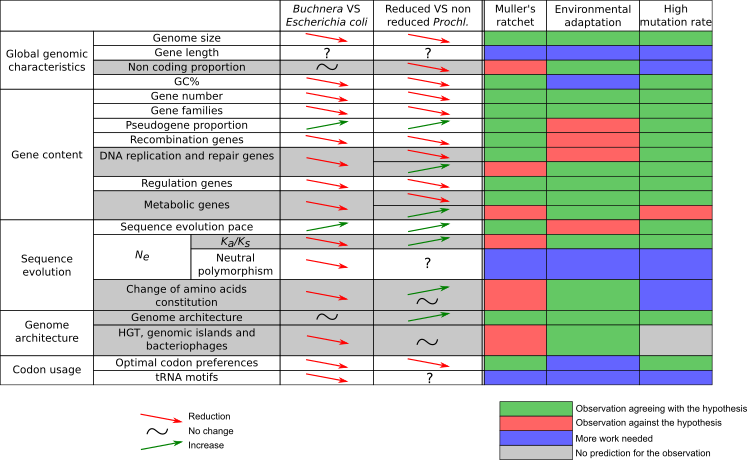

<small>Hypothesis from [Marais et al, 2008](http://link.springer.com/article/10.1007/s10709-007-9226-6) and [Partensky & Garczarek, 2010](http://annualreviews.org/doi/abs/10.1146/annurev-marine-120308-081034) Table adapted from [Batut et al, 2014](http://www.nature.com/nrmicro/journal/v12/n12/abs/nrmicro3331.html)</small>

----

### Hypotheses for reductive genome evolution

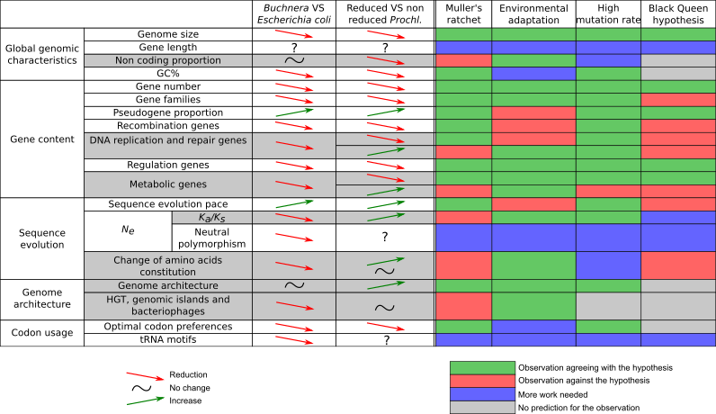

<small>Hypothesis from [Moris et al, 2012](http://mbio.asm.org/content/3/2/e00036-12.short) Table adapted from [Batut et al, 2014](http://www.nature.com/nrmicro/journal/v12/n12/abs/nrmicro3331.html)</small>

----

## Reductive genome evolution in *Prochlorococcus*

- No hypotheses to explain all genome characteristics for *Prochlorococcus*
- Need for supplementary studies

----

### Analyses of *Prochlorococcus* reductive genome evolution

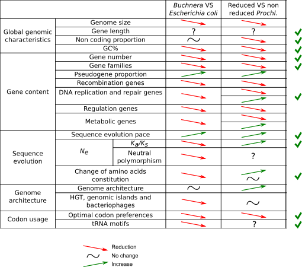

---

## Genome architecture  and reductive evolution

*Impact of genome reduction on the genome structure?*

----

### Study using phylogenetic contrasts

----

### Genome structure study

- Data
    - 12 *Prochlorococcus* genomes and 6 marine *Synechococcus* genomes
    - Phylogenetic tree built with [PhyML](http://www.atgc-montpellier.fr/phyml/) on 693 orthologous gene families aligned with [Prank](https://www.ebi.ac.uk/goldman-srv/prank/prank/) 
    - Gene positions extracted from NCBI database
    - Operon data from [Memon et al, 2013](http://link.springer.com/article/10.1007/s10482-012-9813-0)
- Methods
    - Phylogenetic contrasts

----

### Intergenic median distance and non coding bases proportion

----

### Genome architecture evolution

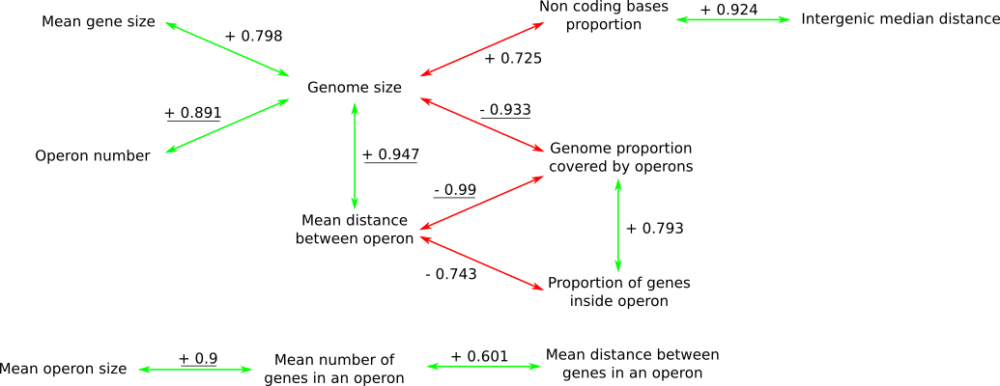

---

## Gene content evolution

*Were there only gene losses? Where were the genes mostly lost?*

----

### Previous studies

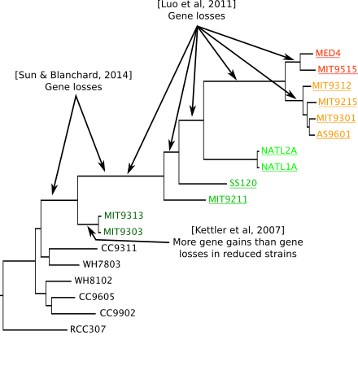

<small>Information extracted from [Kettler et al, 2007](http://journals.plos.org/plosgenetics/article?id=10.1371/journal.pgen.0030231), [Luo et al, 2011](http://mbe.oxfordjournals.org/content/28/10/2751.short) and [Sun & Blanchard, 2014](http://journals.plos.org/plosone/article?id=10.1371/journal.pone.0088837)  Methods using maximum parsimony</small>

----

### Reconstruction of the gene loss and gain tree

- Data
    - 12 *Prochlorococcus* genomes and 6 marine *Synechococcus* genomes
    - Phylogenetic tree built with [PhyML](http://www.atgc-montpellier.fr/phyml/) on 693 orthologous gene families aligned with [Prank](https://www.ebi.ac.uk/goldman-srv/prank/prank/) 
    - 3,778 gene families (with paralogous and orphan genes) extracted from [Hogenom6](http://doua.prabi.fr/databases/hogenom/home.php?contents=query)
- Methods
    - Computation of *a posteriori* gene families size for each internal node with [Count](https://academic.oup.com/bioinformatics/article/26/15/1910/189891/Count-evolutionary-analysis-of-phylogenetic)
    - Reconstruction of loss and gain gene tree

----

### Gene losses and gains

----

### Origin of the lost genes

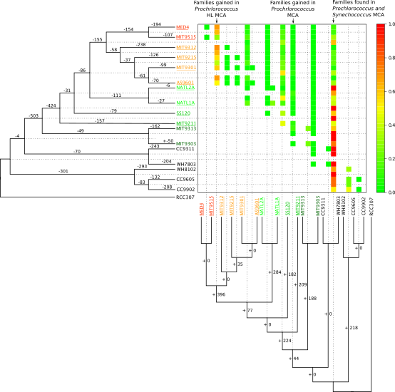

---

## Gene length evolution

*Are the gene lengths impacted by the genome reduction?*

----

## Gene length and Genome size

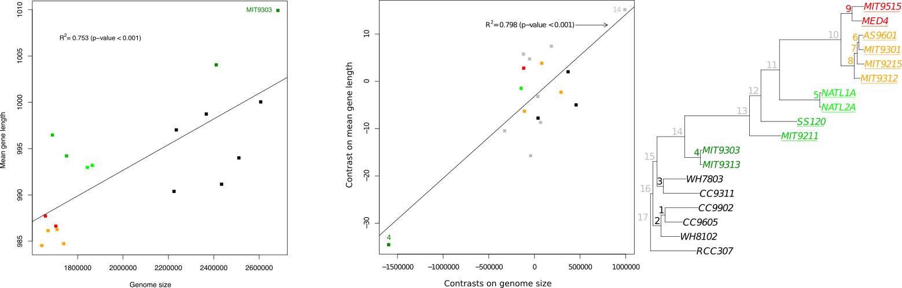

----

### Length gene evolution reconstruction

- Data
    - 12 *Prochlorococcus* genomes and 6 marine *Synechococcus* genomes
    - Phylogenetic tree built with [PhyML](http://www.atgc-montpellier.fr/phyml/) on 693 orthologous gene families aligned with [Prank](https://www.ebi.ac.uk/goldman-srv/prank/prank/) 
    - 693 orthologous gene families (one gene per genome) extracted from [Hogenom6](http://doua.prabi.fr/databases/hogenom/home.php?contents=query)
- Method
    - Estimation of insertions and deletions inside the gene families using [Prank](https://www.ebi.ac.uk/goldman-srv/prank/prank/)
    - Reconciliation between gene family and species trees using [Prunier](http://pbil.univ-lyon1.fr/software/prunier/)

----

### Reconstruction of the gene length evolution

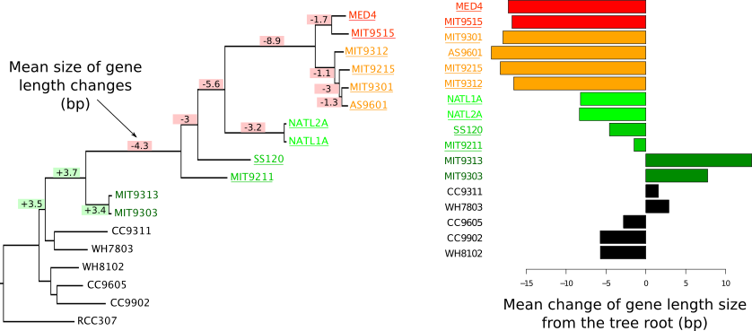

----

### Mean gene length change  since *Prochlorococcus* and *Synechococcus* CA

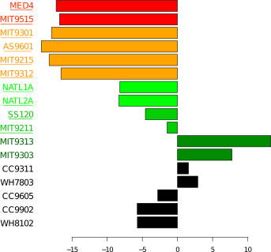

---

## GC content, codon usage,  tRNA genes and optimal codons

*What is the impact of AT enrichment? What is behind?*

----

### GC content evolution

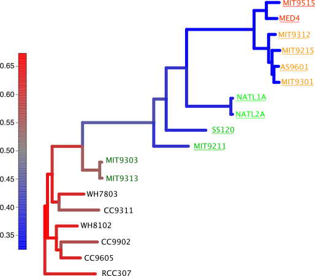

----

### Study of codon usage,  tRNA genes and optimal codons

- Data
    - 12 *Prochlorococcus* genomes and 6 marine *Synechococcus* genomes
    - Phylogenetic tree built with [PhyML](http://www.atgc-montpellier.fr/phyml/) on 693 orthologous gene families aligned with [Prank](https://www.ebi.ac.uk/goldman-srv/prank/prank/) 
    - 693 orthologous gene families (one gene per genome) extracted from [Hogenom6](http://doua.prabi.fr/databases/hogenom/home.php?contents=query)
    - Expression data for MED4 from [Wang et al, 2014](https://bmcmicrobiol.biomedcentral.com/articles/10.1186/1471-2180-14-11)
- Method
    - Custom scripts to compute GCs, ENC, ENC', inter species analysis of amino acid and synonymous codon usage, optimal codons (2 methods)
    - Extraction of tRNA genes using [tRNAscan-SE](http://lowelab.ucsc.edu/tRNAscan-SE/)
    - tRNA gene losses and gains build using Wagner's parcimony

----

### Composition bias

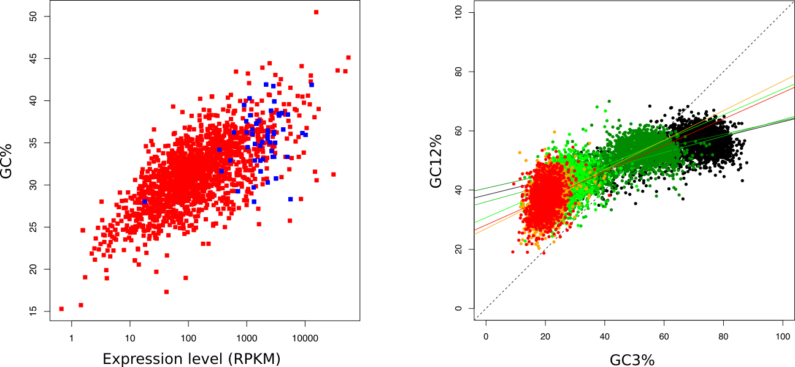

----

### Effective number of codons

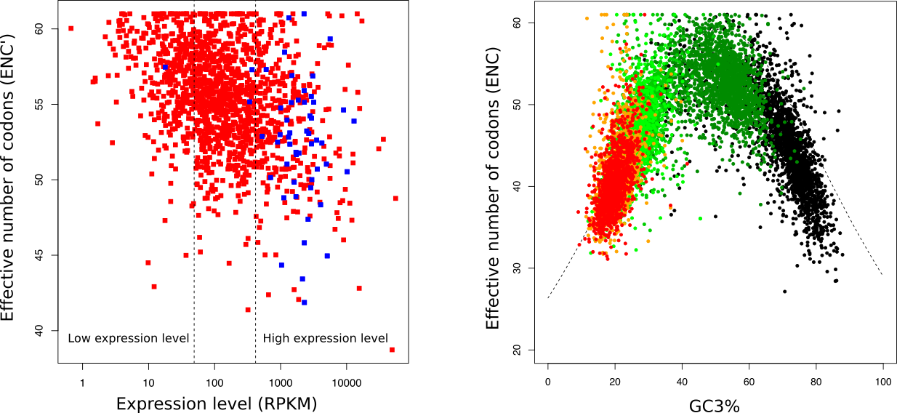

----

### Synonymous codon and amino acids usage

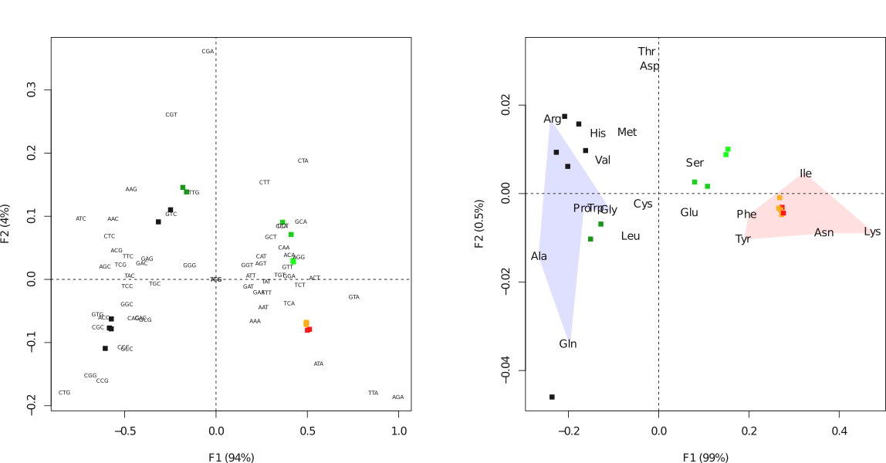

----

### tRNA genes

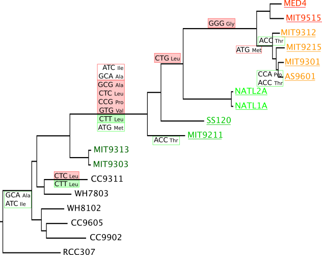

----

### tRNA genes and optimal codons

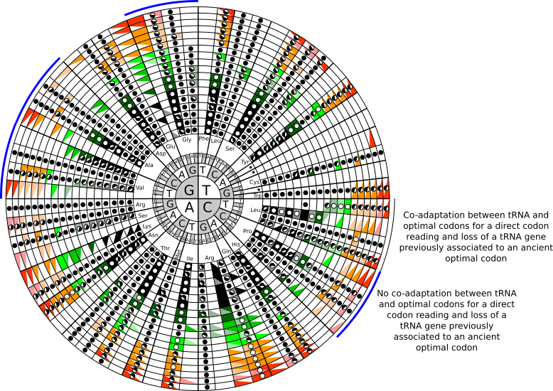

----

### Impact of AT enrichment on the CDS?

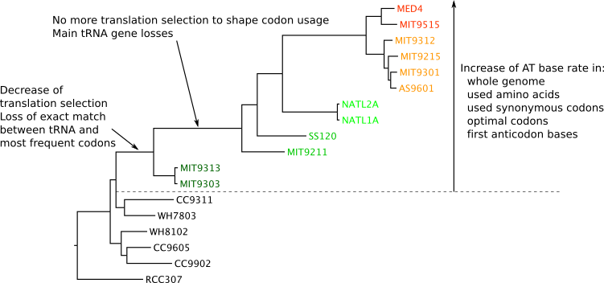

---

## Sequence evolution and selective pressures

----

### Sequence evolution speed

----

### Selective pressure estimation

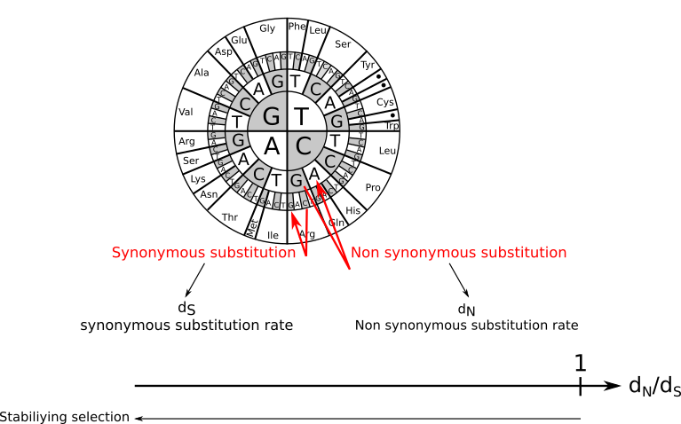

----

### Changes in selective pressures? Previous estimations

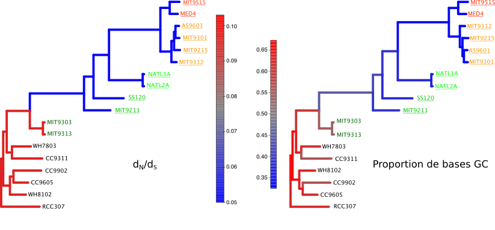

<small>dN/dS estimated as in [Hu & Blanchard, 2009](http://mbe.oxfordjournals.org/content/26/1/5.short), [Yu et al, 2012](http://www.sciencedirect.com/science/article/pii/S1055790311004039), [Sun & Blanchard, 2014](http://journals.plos.org/plosone/article?id=10.1371/journal.pone.0088837)</small>

----

### Changes in selective pressures? With correction of GC content

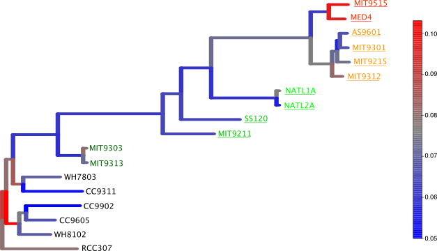

<small>dN/dS estimated using [Bio++](http://biopp.univ-montp2.fr/wiki/index.php/Main_Page) and [a specific model](https://smpgd2014.sciencesconf.org/conference/smpgd2014/pages/30011.pdf)</small>

---

## Summary

----

### Changes in *Prochlorococcus*?

---

### Future work

Integrating all the new available genome

Issues

- Integration of the draft and non annotated genomes ?
- Need to build a new datasetcreate the orthologous gene family set

----

### Future work

- Genome structure
    - Looking at the transcriptome structure
    - Finding more reliable operonic data
- Gene losses and gains
    - Relate the lost and gained genes to annotation
- Gene length evolution
    - Relate gene length changes to biological annotations
    - Relate gene length changes to selective pressures
- 

---

## Sup slides

----

### Muller's ratchet

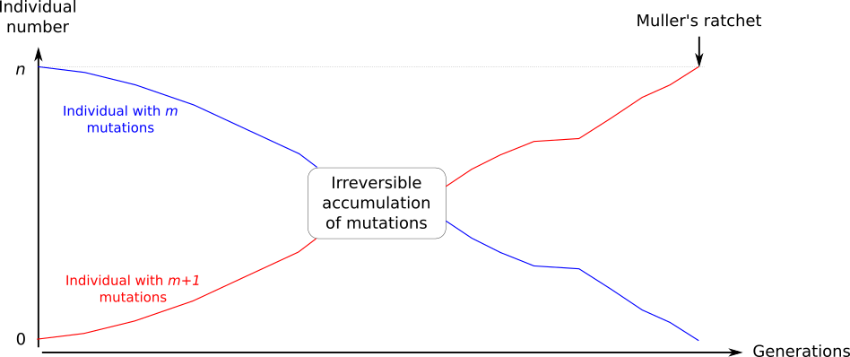

----

### Population size, mutational bias and selection

----

### Intragenic recombination estimation

*Scheme to explain intragenic recombination???*

*Syn* / *Prochl* HL | Non recomb. | Recomb. | Missing | **Total**
--- | --- | --- | --- | --- | ---
Non recomb. | 589 | 92 | 246 | **927**
Recomb. | 96 | 21 | 41 | **158**
Missing | 308 | 27 | - | **335**
**Total** | **993** | **140** | **287** | -

*Methods:* PHI

Note:

Recombinaison intragénique à l’aide du logiciel PHI (Bruen et al., 2006), qui permet de détecter la présence de recombinaison dans des alignements multiples à l’échelle des gènes en identifiant des sites dont l’histoire est incompatible avec l’histoire de la famille de gènes. Cette méthode est l’une des plus robustes aux variations des taux de recombinaison, aux divergences des séquences et de dynamiques de population (Bruen et al., 2006). L’objectif est de déterminer si une famille de gènes homologues a subi des évènements de conversion de gènes parmi les membres des taxons d’intérêt. Pour éviter un effet possible du nombre de gènes dans l’alignement sur l’estimation de la recombinaison, l’étude se concentre sur des familles de gènes homologues sans paralogues.

- 6 strains for each group
- homologous gene families

