Hello! I am [Bérénice](http://bebatut.fr/), the author of following slides.

<small>
This slide does not exist in original deck. It is useful if you are not familiar with [Reveal.JS](https://github.com/hakimel/reveal.js), used here.
</small>

The easiest way to navigate this slide deck is by hitting `[space]`on your keyboard.

---

### Analyses of *Prochlorococcus* genomes in a phylogenetic framework

Determine the causes and characteristics of genome reduction

Bérénice Batut

<small>
University of Freiburg  Hess lab meeting  February 2017
</small>

---

## Evolution

----

### How most people see evolution?

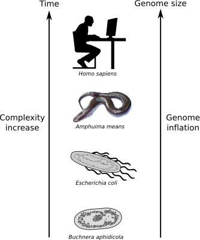

But it's WRONG!

----

### Facts about evolution

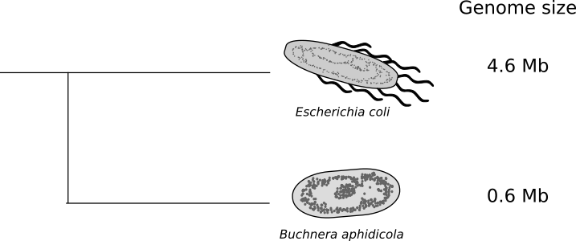

- Same evolution time for all organisms
- No correlation between complexity and genome size
- Reductive genome evolution

How to explain the actual differences in genome size?

---

## Reductive genome evolution in endosymbionts
### Example of *Buchnera aphidicola*

----

### Genome degeneration syndrom

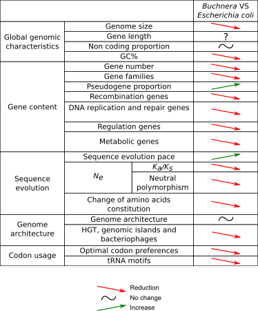

<small>Adapted from [Batut et al, 2014](http://www.nature.com/nrmicro/journal/v12/n12/abs/nrmicro3331.html)</small>

----

### Muller's ratchet

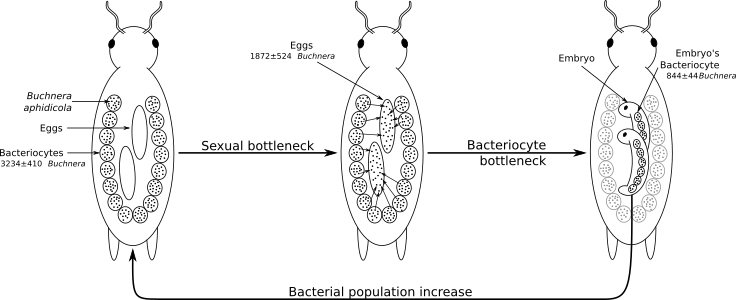

<small>Adapted from [Mira & Moran, 2002](http://link.springer.com/article/10.1007/s00248-002-0012-9)</small>

- Small population size with frequent bottlenecks
- No recombination

----

### Smallest genomes in the smallest populations?

<small>Relation between effective population size and genome size Figure inspired from [Kuo et al, 2009](http://genome.cshlp.org/content/19/8/1450.short)</small>

---

## Reductive genome evolution in *Prochlorococcus*
### An counter-intuitive case 

----

### *Prochlorococcus*

<small>Figure adapted from [Flombaum et al, 2013](http://www.pnas.org/content/110/24/9824.short)</small>

----

### *Prochlorococcus*

<small>Table adapted from [Batut et al, 2014](http://www.nature.com/nrmicro/journal/v12/n12/abs/nrmicro3331.html)</small>

----

### Changes during *Prochlorococcus* evolution

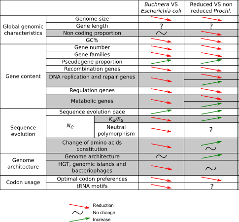

<small>Table adapted from [Batut et al, 2014](http://www.nature.com/nrmicro/journal/v12/n12/abs/nrmicro3331.html)</small>

----

### Hypotheses for reductive genome evolution

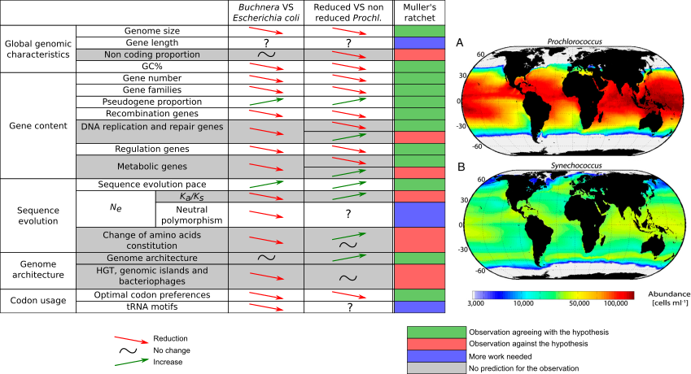

<small> Figures adapted from [Flombaum et al, 2013](http://www.pnas.org/content/110/24/9824.short)</small>

----

### Hypotheses for reductive genome evolution

<small>Hypothesis from [Rocap et al, 2003](http://www.nature.com/nature/journal/v424/n6952/abs/nature01947.html), [Dufresne et al, 2005](https://genomebiology.biomedcentral.com/articles/10.1186/gb-2005-6-2-r14), [Giovannoni et al, 2005](http://science.sciencemag.org/content/309/5738/1242), [Kettler et al, 2007](http://journals.plos.org/plosgenetics/article?id=10.1371/journal.pgen.0030231), and other Table adapted from [Batut et al, 2014](http://www.nature.com/nrmicro/journal/v12/n12/abs/nrmicro3331.html)</small>

----

### Hypotheses for reductive genome evolution

<small>Hypothesis from [Marais et al, 2008](http://link.springer.com/article/10.1007/s10709-007-9226-6) and [Partensky & Garczarek, 2010](http://annualreviews.org/doi/abs/10.1146/annurev-marine-120308-081034) Table adapted from [Batut et al, 2014](http://www.nature.com/nrmicro/journal/v12/n12/abs/nrmicro3331.html)</small>

----

### Hypotheses for reductive genome evolution

<small>Hypothesis from [Moris et al, 2012](http://mbio.asm.org/content/3/2/e00036-12.short) Table adapted from [Batut et al, 2014](http://www.nature.com/nrmicro/journal/v12/n12/abs/nrmicro3331.html)</small>

----

## Reductive genome evolution in *Prochlorococcus*

- No hypotheses to explain all genome characteristics for *Prochlorococcus*
- Need for supplementary studies

----

### Analyses of *Prochlorococcus* reductive genome evolution

---

## Genome architecture and reductive evolution

*add what is expected in a table*

----

### Genome architecture evolution study using phylogenetic contrasts

----

### Intergenic median distance and non coding bases proportion

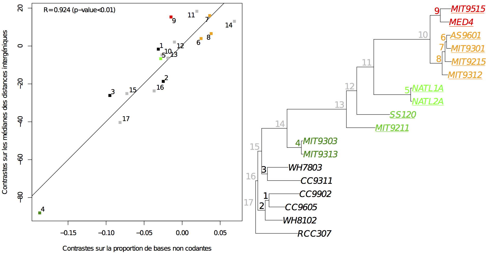

----

### Genome architecture evolution

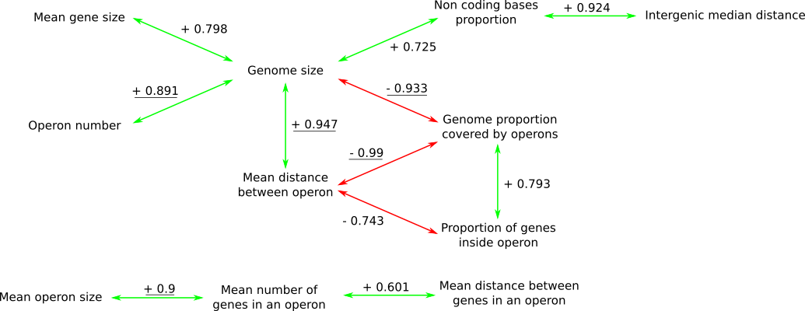

----

### Intragenic recombination estimation

*Scheme to explain intragenic recombination???*

*Syn* / *Prochl* HL | Non recomb. | Recomb. | Missing | **Total**
--- | --- | --- | --- | --- | ---
Non recomb. | 589 | 92 | 246 | **927**
Recomb. | 96 | 21 | 41 | **158**
Missing | 308 | 27 | - | **335**
**Total** | **993** | **140** | **287** | -

*Methods:* PHI

Note:

Recombinaison intragénique à l’aide du logiciel PHI (Bruen et al., 2006), qui permet de détecter la présence de recombinaison dans des alignements multiples à l’échelle des gènes en identifiant des sites dont l’histoire est incompatible avec l’histoire de la famille de gènes. Cette méthode est l’une des plus robustes aux variations des taux de recombinaison, aux divergences des séquences et de dynamiques de population (Bruen et al., 2006). L’objectif est de déterminer si une famille de gènes homologues a subi des évènements de conversion de gènes parmi les membres des taxons d’intérêt. Pour éviter un effet possible du nombre de gènes dans l’alignement sur l’estimation de la recombinaison, l’étude se concentre sur des familles de gènes homologues sans paralogues.

- 6 strains for each group
- homologous gene families

---

## Gene content evolution

*add what is expected in a table*

----

### Previous studies

----

### Reconstruction of the gene losses and gains

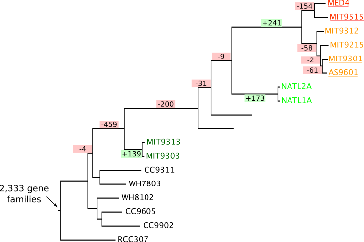

<small>Tree with gene losses and gains built with [Count](https://academic.oup.com/bioinformatics/article/26/15/1910/189891/Count-evolutionary-analysis-of-phylogenetic) on 3,778 gene families</small>

---

## Gene length evolution

*add what is expected in a table*

----

### Reconstruction of the gene length evolution

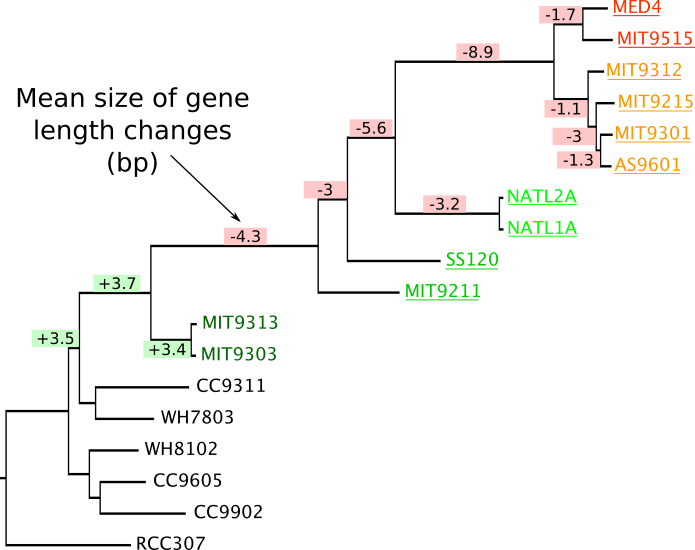

<small>Estimation of insertions and deletions inside 693 gene families using [Prank](https://www.ebi.ac.uk/goldman-srv/prank/prank/) after reconciliation between gene family and species trees using [Prunier](http://pbil.univ-lyon1.fr/software/prunier/)</small>

---

## GC content, codon usage, tRNA and optimal codons

*add what is expected in a table*

----

### GC content evolution

*add tree with GC content evolution*

----

### Composition bias

----

### Effective number of codons

----

### Optimal codons

----

### tRNA genes

----

### Impact of AT enrichment on the CDS?

<small>Study for 693 gene families of: GC content, effective number of codon, optimal codons, codon usage, amino acid usage, tRNA genes 
 And the relation behind these indicators</small>

---

## Sequence evolution and selective pressures

----

### Sequence evolution speed

----

### Selective pressure estimation

----

### Changes in selective pressures? Previous estimations

<small>dN/dS estimated as in [Hu & Blanchard, 2009](http://mbe.oxfordjournals.org/content/26/1/5.short), [Yu et al, 2012](http://www.sciencedirect.com/science/article/pii/S1055790311004039), [Sun & Blanchard, 2014](http://journals.plos.org/plosone/article?id=10.1371/journal.pone.0088837)</small>

----

### Changes in selective pressures? With correction of GC content

<small>dN/dS estimated using [Bio++](http://biopp.univ-montp2.fr/wiki/index.php/Main_Page) and [a specific model](https://smpgd2014.sciencesconf.org/conference/smpgd2014/pages/30011.pdf)</small>

---

## Summary

----

### Changes in *Prochlorococcus*?

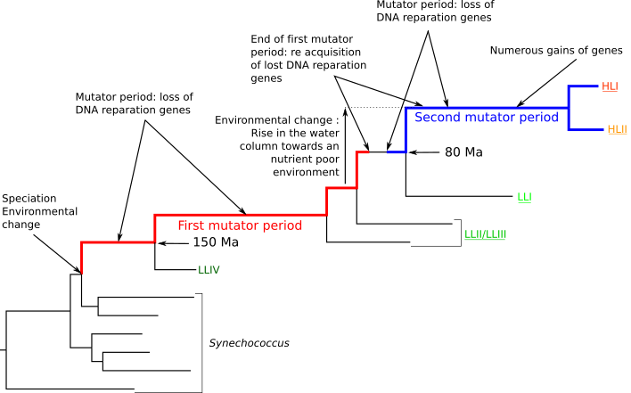

---

## Sup slides

----

### Muller's ratchet

----

### Population size, mutational bias and selection

----

